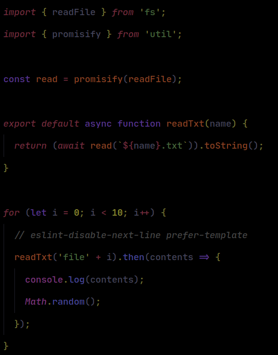

# Pitch Black theme for VSCode
A 100% dark VSCode theme, built up for coding in absolute darkness. Since the colors have a low contrast, **You'll experience lower eye strain using this theme**.

## Screenshots
#### JavaScript

## Support for other languages
This theme is built with [`vscode-theme-generator`](https://github.com/moxer-theme/code-theme-generator), And probably a good support for other languages, although I haven't tested it.

## Todos
- [ ] Improve the workbench colors
- [ ] Add more screenshots